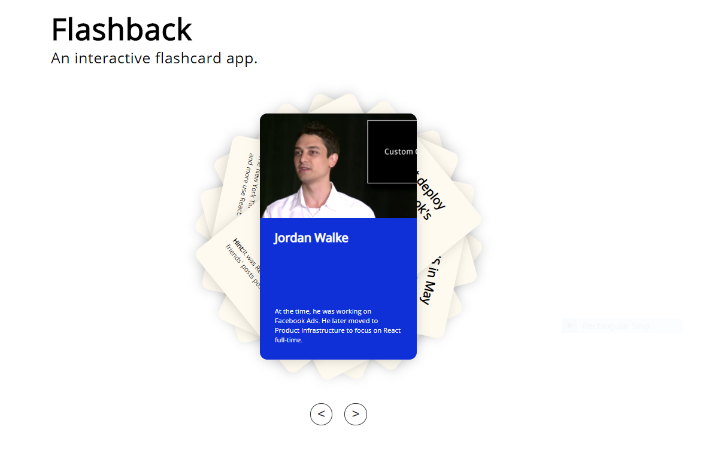

An interactive flashcard app that tells the story of React and its role in the web industry.

How to use:

1) https://flashback-carl-hofstrom.herokuapp.com
2) Guess the answer!
3) Click on the card itself for the answer
2) Click the left and right arrows '<' '>' to cycle through the cards

Application Responsiblities:

Expand on creating webpages using HTML, building applications using Javascript, React, as well as learn
more about ES6 features. 

Built using ReactJS by
Carl Hofstrom hofstromcarl@gmail.com

https://flashback-carl-hofstrom.herokuapp.com

